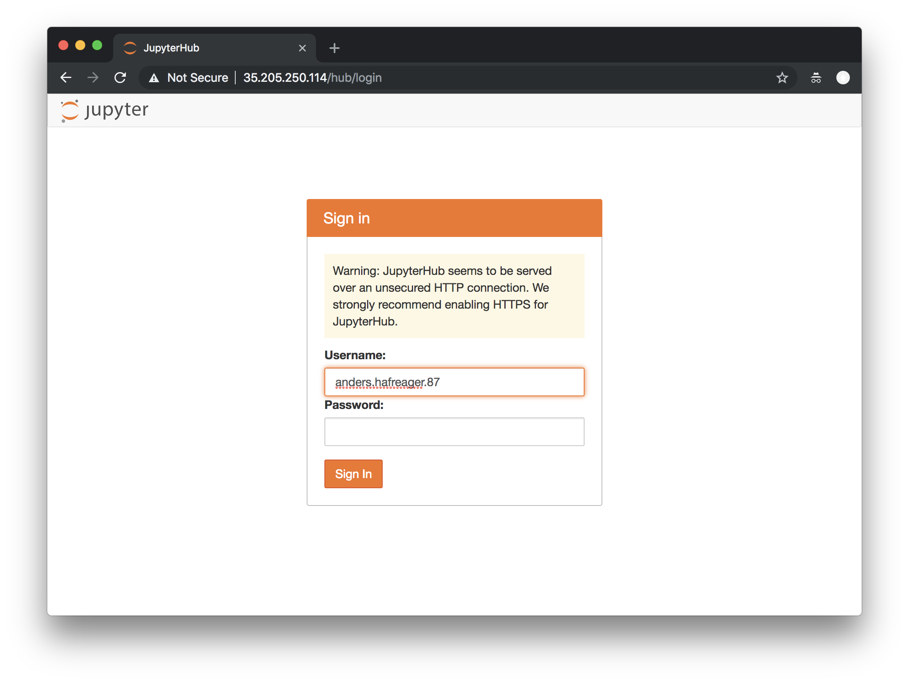
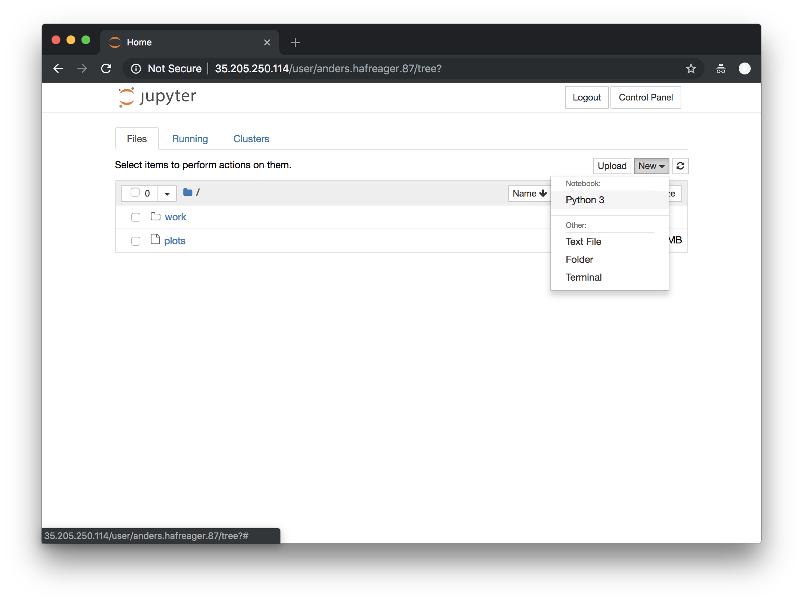
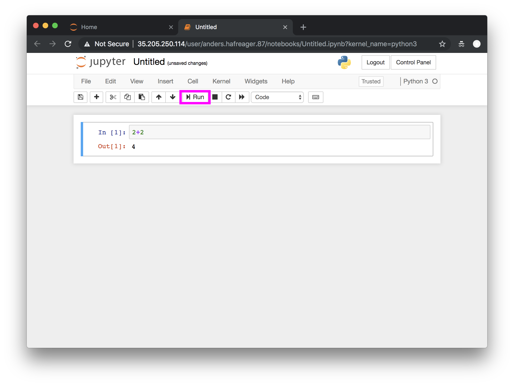

# Kom i gang med Python
For denne workshopen har vi satt opp et system slik at alle kan kjøre Python i nettleseren. Normalt kan man kjøre Python på egen maskin, men når noen har Windows, mens andre har Mac kan det ofte ta tid å få satt opp for alle. 

## 1. Åpne Python
For å åpne Python kan du besøke

http://bit.ly/innovasjon_python (denne linken virker kun i dag)


Du vil da møte et bilde som dette:

Alle brukernavn og passord vil virke, men velg `fornavn.etternavn.årstall` så er vi sikre på at dere har hver deres maskin med Python. Logg inn ved å trykke `Sign In`.

## 2. Lag ny `arbeidsbok`
Etter å ha logget inn ser du følgende side. For å begynne å skrive og kjøre kode trykker du på `New` og velger `Python 3`.

Du får da et vindu som ser slik ut. Her kan du skrive kode og trykke `Run` (markert med rosa).



## 3. Kjør kode
I feltet der det står `In [ ]:` kan du skrive Python-kode. Denne kjøres ved å trykke på `Run` (knapp på skjermen) eller `Ctrl+Enter` (tastaturet). Hvis du for eksempel skriver
```Python
2+2
```
og trykker `Run`, kommer naturligvis svaret `4` ut.

# Oppgaver i Python
## Tall
Vi kan regne vanlig pluss, minus, gange og dele ved å bruke symbolene 
- `+` (pluss)
- `-` (minus)
- `*` (gange)
- `/` (dele)

### Eksempler:
```python
2+2
```

```python
5-2
```

### Oppgave 1
- Prøv å regne ut noen forskjellige uttrykk (10 delt på 5).

## Variabler
Vi kan lagre tall i såkalte variabler slik vi gjorde i skolen. Ved å skrive
```python
a = 5
b = 10
a + b
```
får vi svaret `15`. Navnet på variabelen er likegyldig, og det oppfordres ofte til å velge fornuftige navn
```python
anders_sitt_favoritt_tall = 27
```

### Oppgave 2
- Prøv å regne ut noen forskjellige uttrykk med variabler. Prøv også med parenteser: `b * (a + anders_sitt_favoritt_tall)`. 


## Tekst (strings)
Variabler kan også inneholde tekst. Det markeres ved å plassere tekst innimellom anførselstegn `""`
```python
tekst1 = "Dette er en tekst"
tekst2 = "Dette er en annen tekst"
print(tekst1)
print(tekst2)
```

Vi kan plusse sammen tekst (legge de etter hverandre)
```python
tekst3 = tekst1 + tekst2
print(tekst3)
```

Senere skal vi gjøre analyse på store mengder tekst. Derfor trenger vi å kunne behandle tekstene litt. Vi kan erstatte deler av teksten med annen tekst ved å bruke `replace`.
```python
tekst = "Jeg heter Anders."
print(tekst)
tekst = tekst.replace("Anders", "Sunniva")
print(tekst)
tekst = tekst.replace(".", "!!!")
print(tekst)
```

Vi kan gjøre om alle bokstaver til små bokstaver ved å bruker `.lower()`
```python
tekst = "Stor forbokstav og Stor bokstav midt inni."
print(tekst)
tekst = tekst.lower()
print(tekst)
```

### Oppgave 3
Putt forskjellige tekster inn i variabler. Test å *plusse* sammen tekster og endre innholdet med `replace`, `lower` og `upper`.

## Logikk (`True` og `False`)
Dere har i dag hørt om if-tester. De brukes til å få dataprogrammet til å gjøre forskjellige ting avhengig av input. Man bruker to likhetstegn `==` for å teste likhet.

```python
a = 5
if a == 5:
  print("a er faktisk 5")
else:
  print("a er ikke 5")
```

Man kan teste flere ting etterhverandre

```python
a = 5
if a == 5:
  print("a er faktisk 5")
else if a == 10:
  print("a er 10")
else:
  print("A er hverken 5 eller 10")
```

```python
a = 5
if a < 10:
  print("a er mindre enn 5")
else:
  print("A er større enn eller lik 10")
```

Vi kan sjekke om en tekst inneholder en annen tekst
```python
tekst = "Dette er en tekst"
if "Dette" in tekst:
  print("Teksten inneholder 'Dette'.")
else:
  print("Teksten inneholder ikke 'Dette'.")
```

### Oppgave 4
Prøv å endre verdien til `a` til andre ting og se utfallet.

### Oppgave 5
Lag en ny variabel `b` og sjekk likhet mellom `a` og `b`.

### Oppgave 6
La variablene inneholde tekst i stedet for tall og sjekk likhet.

### Oppgave 7
Lag en variabel med teksten `Dette er en tekst`. Gjør om til små bokstaver med `lower`. 

## Lister
En annen nyttig type i Python er lister. De er nettopp det navnet tilsier: lister.

```python
liste = [1,2,3,4,5]
print(liste)
```

Man kan legge til nye ting i listen med `append`

```python
liste = [1,2,3,4,5]
print(liste)
liste.append(6)
print(liste)
```

Vi kan hente ut akkurat det elementet vi vil fra listen (første element starter på 0)
```python
liste = [1,2,3,4,5]
print(liste[0])
print(liste[4])
```

Man kan løkke over alle elementene i en liste ved å bruke `for`
```python
liste = [1,2,3,4,5]
for tall in liste:
  print(tall)
```

Vi kan bruke `range` til å lage liste med heltall. Å lage en liste med alle heltallene opp til 50 kan gjøres med (`range` bruker til, men ikke med)
```python
liste = range(51)
for tall in liste:
  print(tall + 10)
```

### Oppgave 8
Lag en liste med alle tallene opp til 20. Print alle tallene opp ved å bruke en `for`-løkke.

### Oppgave 9
Lag en liste med alle tallene opp til 20. Lag en løkke over alle tallene og print tallet hvis det er mindre enn 10. (Hint: bruk `if` og krokodilletegnet `<`).

### Oppgave 10
Lag en liste med alle tallene opp til 20. Lag en løkke over alle tallene og print det dobbelte av alle tall større enn 10.

### Oppgave 11
Print alle tallene som er delelige med 2 opp til 50. (Hint: spør Google om hjelp).
